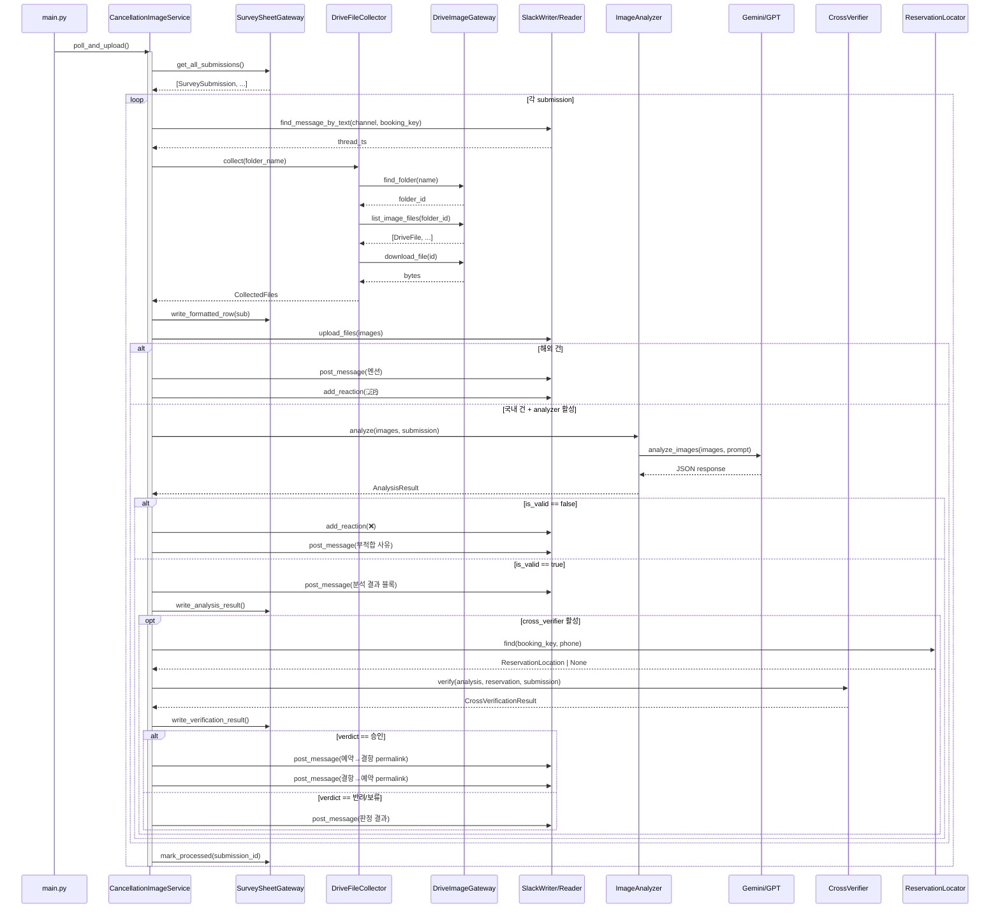
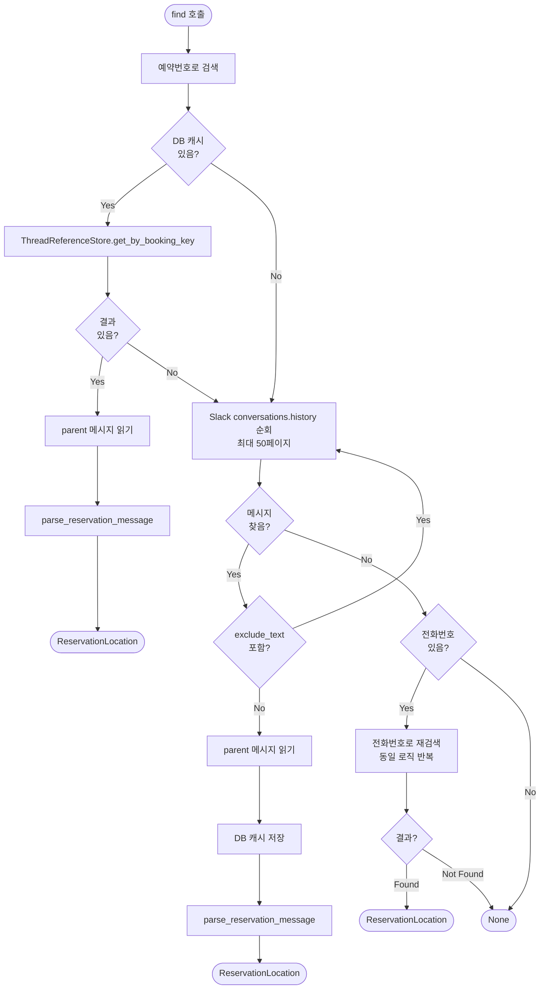
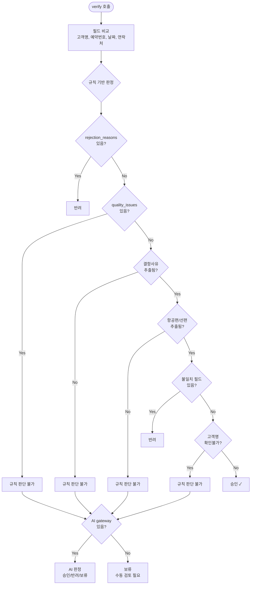

# 결항확인서 검증 시스템 — 기술 설계 문서

> 대상 독자: 이 프로젝트에 처음 합류하는 개발자
> 최종 수정: 2026-03-24

이 문서는 [Diataxis 프레임워크](https://docs.divio.com/documentation-system/)에 따라 4개 파트로 구성되어 있다.

| 파트 | 성격 | 언제 읽나 |
|------|------|-----------|
| **Part 1. 개요** | 이해 (Explanation) | 시스템이 뭔지 처음 파악할 때 |
| **Part 2. 시작하기** | 따라하기 (Tutorial) | 처음 로컬에서 돌려볼 때 |
| **Part 3. 레퍼런스** | 찾아보기 (Reference) | 특정 컴포넌트/로직을 확인할 때 |
| **Part 4. 가이드** | 문제 해결 (How-to) | 테스트 작성, 디버깅할 때 |

---

## 목차

**Part 1. 개요**

- [1.1 비즈니스 컨텍스트](#11-비즈니스-컨텍스트)
- [1.2 처리 흐름 요약](#12-처리-흐름-요약)
- [1.3 점진적 활성화](#13-점진적-활성화)
- [1.4 아키텍처](#14-아키텍처)
- [1.5 핵심 워크플로우](#15-핵심-워크플로우)

**Part 2. 시작하기**

- [2.1 Quick Start](#21-quick-start)
- [2.2 워크스루 예시](#22-워크스루-예시)
- [2.3 전체 흐름 시퀀스 다이어그램](#23-전체-흐름-시퀀스-다이어그램)

**Part 3. 레퍼런스**

- [3.1 컴포넌트 상세](#31-컴포넌트-상세)
- [3.2 데이터 모델](#32-데이터-모델)
- [3.3 교차검증 판정 로직](#33-교차검증-판정-로직)
- [3.4 설정](#34-설정)
- [3.5 DI 와이어링](#35-di-와이어링)
- [3.6 데이터 기록 상세](#36-데이터-기록-상세)
- [3.7 에러 처리 전략](#37-에러-처리-전략)
- [3.8 해외 건 처리](#38-해외-건-처리)

**Part 4. 가이드**

- [4.1 테스트 작성 가이드](#41-테스트-작성-가이드)
- [4.2 트러블슈팅](#42-트러블슈팅)
- [4.3 용어 사전](#43-용어-사전)

---

## Part 1. 개요

> 이 시스템은 무엇이고, 왜 이렇게 설계했는가

## 1.1 비즈니스 컨텍스트

렌트카 고객이 항공편 결항으로 예약을 취소해야 할 때, **결항확인서**(항공사 발급 증빙)를 제출한다.
이 시스템은 제출된 결항확인서를 자동으로 수집·분석·검증하여 운영팀의 수작업을 줄인다.

## 1.2 처리 흐름 요약

```text
고객 Jotform 제출 → Google Sheets 기록 → 시스템 폴링
→ Drive에서 이미지 수집 → Slack 스레드에 업로드
→ AI 분석 (Gemini/GPT) → 교차검증 (예약 데이터 비교) → 판정 (승인/반려/보류)
```

## 1.3 점진적 활성화

모든 단계가 반드시 필요하지는 않다. 설정에 따라 **최소 동작**부터 **완전 자동화**까지 점진적으로 활성화된다:

| 레벨 | 동작 | 필요 조건 |
|------|------|-----------|
| **Level 0** | 이미지 수집 + Slack 업로드만 | 기본 설정 (Drive, Sheet, Slack) |
| **Level 1** | + AI 이미지 분석 | `analysis.enabled: true` + API 키 |
| **Level 2** | + 교차검증 (예약 데이터 비교) | Level 1 + 예약 채널 설정 |
| **Level 3** | + 양방향 permalink (승인 시) | Level 2 (자동) |

이 설계 덕분에 API 키 없이도 이미지 업로드 기능만 사용할 수 있고, 분석 모델에 문제가 있어도 업로드는 정상 동작한다.

## 1.4 아키텍처

### 컴포넌트 의존성 다이어그램

```text
CancellationImageService (Orchestrator)
├── SurveySheetGateway          ← Google Sheets (설문 응답 읽기/쓰기)
├── DriveFileCollector           ← Google Drive (이미지 수집)
│   ├── DriveImageGateway        ← Drive API 래퍼
│   └── PdfConverter             ← PDF → 이미지 변환
├── SlackMessageWriter           ← Slack 메시지/파일 업로드
├── SlackMessageReader           ← Slack 메시지 조회
├── ImageAnalyzer?               ← AI 이미지 분석 (optional)
│   └── ImageAnalysisGateway     ← Gemini 또는 GPT API
├── CrossVerifier?               ← 교차검증 (optional)
│   └── ImageAnalysisGateway?    ← AI 판단 fallback (optional)
└── ReservationLocator?          ← 예약 스레드 검색 (optional)
    ├── ThreadReferenceStore?    ← DB 캐시 (optional)
    └── SlackMessageReader       ← Slack API 폴백
```

> `?` 표시는 `None`일 수 있는 optional 의존성

### 레이어 경계

```text
Listener (main.py)     → CancellationImageService 호출 (startup poll)
    ↓
Service (Orchestrator) → 컴포넌트 조합, 워크플로우 제어
    ↓
Service (Component)    → 단일 책임 (분석, 검증, 수집 각각 독립)
    ↓
Infrastructure         → 외부 API 통신 (Slack, Drive, Sheets, Gemini, GPT)
```

**경계 규칙**: Component 서비스는 외부 API를 직접 호출하지 않는다. Protocol 인터페이스를 통해서만 접근하며, 실제 구현체 주입은 `ServiceContainer`가 담당한다.

## 1.5 핵심 워크플로우

**주요 메서드 반환 타입:**

| 메서드 | 반환 타입 | 의미 |
|--------|-----------|------|
| `poll_and_upload()` | `int` | 처리 건수. Lock 실패 시 `-1` |
| `_process_submission()` | `bool` | `True`=처리 완료(성공 또는 중복), `False`=처리 불가(스레드/파일 없음) |
| `_analyze_and_report()` | `None` | 분석+포스트 부작용 함수. 실패해도 예외를 전파하지 않음 |
| `_cross_verify_and_report()` | `None` | 검증+포스트 부작용 함수. 실패해도 예외를 전파하지 않음 |

### `poll_and_upload()` — 진입점

```text
poll_and_upload()
│
├─ Lock 획득 실패 → return -1 (이미 실행 중)
│
└─ _poll_and_upload_locked()
   │
   ├─ survey_sheet.get_all_submissions()
   │  └─ 미처리 설문 응답 목록 조회
   │
   ├─ 중복 제거: 같은 booking_key → 최신 제출만 처리, 이전 것은 mark_processed
   │
   └─ for each submission:
      └─ _process_submission(sub)
```

### `_process_submission()` — 건별 처리

```text
_process_submission(submission)
│
├─ reader.find_message_by_text(channel, booking_key)
│  └─ 결항 채널에서 해당 예약번호가 포함된 스레드 찾기
│  └─ 없으면 → return False (처리 불가)
│
├─ file_collector.collect(folder_name)
│  └─ Drive 폴더 검색 → 파일 다운로드 → PDF 변환
│  └─ 없으면 → return False
│
├─ survey_sheet.write_formatted_row(sub)
│  └─ "운영현황" 시트에 행 선점
│  └─ 중복 기준: 예약번호 + 고객명 + 작성일자 모두 일치
│  └─ 이미 존재하면 → return True (처리 완료로 간주)
│
├─ writer.upload_files(...)
│  └─ 이미지를 Slack 스레드에 업로드
│
├─ PDF 포함 시 → :pdf: 리액션 추가
│
├─ _is_overseas(booking_key)?
│  ├─ Yes → _handle_overseas() → return True
│  │        (멘션 포스트 + 🇯🇵 리액션, 분석 생략)
│  │
│  └─ No → 분석 단계로 진행
│
├─ analyzer 있고 이미지 있으면 → _analyze_and_report()
│
└─ return True
```

### `_analyze_and_report()` — AI 분석 + 교차검증

```text
_analyze_and_report(images, submission, thread_ts)
│
├─ analyzer.analyze(images, submission)
│  └─ 실패 시 → return (업로드는 이미 완료, 분석만 생략)
│
├─ result.is_valid == false?
│  ├─ :x: 리액션 + 부적합 사유 포스트
│  └─ return (교차검증 생략)
│
├─ build_analysis_result_blocks(result)
│  └─ Block Kit으로 변환 → Slack 포스트
│
├─ survey_sheet.write_analysis_result(...)
│  └─ 분석 결과를 시트에 기록
│
└─ cross_verifier 있으면 → _cross_verify_and_report()
   │
   ├─ reservation_locator.find(booking_key, phone)
   │  └─ DB 캐시 → Slack API 폴백으로 예약 스레드 검색
   │
   ├─ 못 찾으면 → verdict="보류", reason="예약 스레드를 찾지 못했습니다."
   │
   ├─ cross_verifier.verify(analysis, reservation, submission)
   │  └─ 규칙 기반 판정 → 불확실하면 AI 판정
   │
   ├─ survey_sheet.write_verification_result(...)
   │
   └─ verdict == "승인" → _post_bidirectional_links()
      └─ 예약 스레드 ↔ 결항 스레드 간 permalink 교환
```

---

## Part 2. 시작하기

> 처음 합류했을 때 따라해보기

## 2.1 Quick Start

```bash
# 1. 의존성 설치
uv sync

# 2. .env 파일 설정 — 최소 필수 항목:
#    SLACK_BOT_TOKEN, SLACK_APP_TOKEN  (Slack 연동)
#    DATABASE_URL                       (Supabase PostgreSQL)
#    GOOGLE_CREDENTIALS_JSON           (Google Drive/Sheets 접근)

# 3. (선택) AI 분석을 활성화하려면 API 키 추가:
#    GEMINI_API_KEY                    (Level 1 이상)
#    OPENAI_API_KEY                    (Fallback 분석)

# 4. config.dev.yaml 확인:
#    cancellation.analysis.enabled: true/false

# 5. DB 마이그레이션
uv run alembic upgrade head

# 6. 앱 실행 — 시작 시 poll_and_upload()가 백그라운드에서 1회 실행됨
uv run python -m app.main
```

> **Tip**: Level 0(이미지 업로드만)으로 시작하려면 `analysis.enabled: false`로 설정. AI 분석이 필요해지면 API 키와 함께 `true`로 변경하면 된다.

## 2.2 워크스루 예시

실제 데이터로 교차검증이 어떻게 진행되는지 처음부터 끝까지 따라가본다.

**상황**: 고객 "홍길동"이 예약번호 `R240318001`로 렌트카를 예약하고, 결항으로 취소를 요청했다.

```text
[입력 데이터]
  설문: 고객명="홍길동", booking_key="R240318001", phone="010-1234-5678"
  AI 분석 결과: 고객명="홍 길동", 날짜="2026-03-18", 항공편="KE123", 결항사유="기상악화"
  예약 데이터: customer_name="홍길동", phone="01012345678",
              rental_period_start=2026-03-18, rental_period_end=2026-03-21

[1단계: 필드 비교]
  고객명:  "홍 길동" vs "홍길동"
           → 공백 제거 후 "홍길동" vs "홍길동"
           → _split_names로 분리 → ["홍길동"] vs ["홍길동"]
           → "홍길동" in "홍길동" and len("홍길동") >= 2 → ✅ 일치

  예약번호: 비교하지 않음 (항공 PNR ≠ 렌트카 예약번호) → 비교불필요

  날짜:    결항일 2026-03-18
           허용 범위 = [2026-03-17, 2026-03-22] (start-1 ~ end+1)
           2026-03-17 ≤ 2026-03-18 ≤ 2026-03-22 → ✅ 일치

  연락처:  설문 "010-1234-5678" → _digits_only → "01012345678"
           예약 "01012345678" → _digits_only → "01012345678"
           완전 일치 → ✅ 일치

[2단계: 규칙 판정]
  rejection_reasons = [] → 부적합 사유 없음
  quality_issues = []    → 품질 이슈 없음
  결항사유 "기상악화"     → 추출됨 ✅
  항공편 "KE123"         → 추출됨 ✅
  불일치 필드             → 없음 ✅
  고객명 확인불가         → 아님 (일치) ✅

  → 판정: 승인 ✓

[3단계: 후속 처리]
  시트에 "교차검증결과: 승인" 기록
  양방향 permalink 생성 (예약 스레드 ↔ 결항 스레드)
```

**반려 예시** — 같은 상황에서 날짜가 `2026-03-10`이라면:

```text
  날짜:    결항일 2026-03-10
           허용 범위 = [2026-03-17, 2026-03-22]
           2026-03-10 < 2026-03-17 → ❌ 불일치

  → 불일치 필드 있음 → 판정: 반려 (사유: "날짜 불일치")
```

**보류 예시** — 항공편이 추출되지 않은 경우:

```text
  AI 분석 결과: 항공편="" (추출 실패)

  → 항공편/선편 추출 안 됨 → 규칙 판단 불가
  → AI gateway 있으면 AI 판정 위임, 없으면 → 보류 (수동 검토 필요)
```

## 2.3 전체 흐름 시퀀스 다이어그램



---

## Part 3. 레퍼런스

> 특정 컴포넌트나 로직을 찾아볼 때

## 3.1 컴포넌트 상세

### CancellationImageService

**역할**: Orchestrator. 모든 컴포넌트를 조합하여 워크플로우를 제어한다.

**파일**: `app/services/cancellation_image_service.py`

**핵심 설계:**

- `threading.Lock`으로 동시 폴링 방지 (중복 처리 차단)
  - **왜 `threading.Lock`?** 이 앱은 Slack Bolt 동기 모드(Socket Mode)로 동작하며, 폴링은 `threading.Thread`에서 실행된다. asyncio 기반이 아니므로 `threading.Lock`이 자연스럽다.
- optional 컴포넌트(`analyzer`, `cross_verifier`, `reservation_locator`)는 `None` 체크 후 호출
- 각 단계는 이전 단계 실패와 독립적 — 이미지 업로드 후 분석이 실패해도 업로드는 유지

### ImageAnalyzer

**역할**: AI에게 이미지를 보내고, 구조화된 `AnalysisResult`로 파싱한다. **데이터 추출만 담당하며 비교 로직은 포함하지 않는다.**

**파일**: `app/services/image_analyzer.py`

**처리 과정:**

1. **이미지 필터링**: 4MB 초과 제외, 최대 10장 제한
   - 초과 시 `quality_issues`에 구체적 메시지 추가 (예: `"이미지 크기 초과: 이미지 3 (5242880 bytes)"`)
2. **프롬프트 구성**: 날짜, 예약번호, 고객명 컨텍스트 포함
3. **AI 호출**: `ImageAnalysisGateway.analyze_images()`
4. **응답 정규화**: `_normalize_response()` — Gemini가 배열을 반환할 수 있으므로 첫 요소만 추출하여 단일 dict로 변환
5. **응답 파싱**: `_parse_response()` — JSON → `AnalysisResult` dataclass. `rejection_reasons`가 list가 아니면 빈 리스트로 강제 변환

**추출 필드** (핵심 6개 + 문서에 있는 모든 추가 정보):

| 필드 | 설명 | 예시 |
|------|------|------|
| 고객명 | 공백 제거, 여러 명은 `/` 구분 | `홍길동/김철수` |
| 예약번호 | 항공사 PNR (렌트카 예약번호와 다름) | `ABC123` |
| 날짜 | `YYYY-MM-DD` 형식 필수 | `2026-03-18` |
| 항공편 | 항공편명 | `KE123` |
| 결항사유 | 결항 원인 | `기상악화` |
| 발급기관 | 문서 발급처 | `대한항공` |

**유효성 검증 (rejection_reasons):**

- 이미지 흐림/판독 불가
- 결항이 아닌 **지연**(delay) 문서
- 고객명 완전 누락 (메신저 대화에서라도 이름이 보이면 OK)
- 날짜 완전 누락
- 여러 문서를 함께 업로드한 경우, **문서 간 날짜/편명 불일치** 감지

> `quality_issues`와 `rejection_reasons`의 차이: `quality_issues`는 이미지 필터링 단계의 문제(크기, 개수)이고, `rejection_reasons`는 AI가 판별한 부적합 사유다. 둘 다 동시에 존재할 수 있다.

### CrossVerifier

**역할**: 분석 결과(문서)와 예약 데이터를 비교하여 승인/반려/보류 판정.

**파일**: `app/services/cross_verifier.py`

> 판정 로직 상세는 [3.3 교차검증 판정 로직](#33-교차검증-판정-로직) 참조

### DriveFileCollector

**역할**: Google Drive에서 파일을 찾고, 다운로드하고, PDF를 이미지로 변환한다.

**파일**: `app/services/drive_file_collector.py`

**처리 과정:**

1. `drive.find_folder(folder_name)` — 폴더명으로 검색
2. `drive.list_image_files(folder_id)` — 이미지/PDF 파일 목록
3. 파일별 다운로드 + PDF는 `PdfConverter`로 페이지별 이미지 변환
4. 결과: `CollectedFiles(images=[(filename, bytes), ...], has_pdf=bool)`

**폴더명 규칙**: `{고객명}_{예약번호}_{제출일시}` (예: `홍길동_ABC123_2026-03-20 14:30:00`)

### ReservationLocator

**역할**: 예약번호(또는 전화번호)로 예약 채널에서 해당 스레드를 찾아 예약 데이터를 추출한다.

**파일**: `app/services/reservation_locator.py`

**검색 전략 (우선순위):**

1. **DB 캐시** (`ThreadReferenceStore`) — 이전 검색 결과 캐시
2. **Slack conversations.history** — 채널 메시지 순회 (최대 50페이지)
3. **전화번호 폴백** — 예약번호로 못 찾으면 전화번호로 재검색

**`exclude_text="예약취소"`**: 예약취소 메시지를 검색 결과에서 제외하여, 취소 건이 아닌 원본 예약 스레드를 찾는다. Slack 메시지 텍스트에 이 문자열이 포함되어 있으면 건너뛰고 다음 메시지를 검색한다.

**에러 복원력:**

- DB 캐시 조회 실패 → 로그 후 Slack API 폴백으로 계속 진행 (`reservation_db_lookup_failed`)
- DB 캐시 저장 실패 → 검색 결과는 정상 반환 (캐시만 누락)

**반환**: `ReservationLocation(data=ReservationData, channel, thread_ts)` 또는 `None`

**검색 흐름 (Mermaid):**



---

## 3.2 데이터 모델

### 입력 데이터

```python
# app/models/cancellation.py

@dataclass
class SurveySubmission:
    """Jotform 설문 응답 1건."""
    submission_id: str       # Jotform 제출 ID
    customer_name: str       # 운전자 성함
    booking_key: str         # 렌트카 예약번호
    submission_date: str     # 접수일 (YYYY-MM-DD HH:MM:SS)
    company_name: str        # 업체명
    phone: str               # 연락처
    image_url: str           # Jotform 업로드 URL
    note: str                # 추가 상담 내용

    @property
    def folder_name(self) -> str:
        """Drive 폴더 검색용: 성함_예약번호_제출날짜"""

@dataclass
class ReservationData:
    """예약 채널 메시지에서 파싱한 예약 정보."""
    booking_key: str
    customer_name: str
    phone: str
    rental_period_start: datetime | None  # 대여 시작일
    rental_period_end: datetime | None    # 대여 종료일
    company_name: str
    payment_amount: int | None

@dataclass
class DriveFile:
    """Google Drive 파일 메타데이터."""
    id: str
    name: str
    mime_type: str  # "image/jpeg", "application/pdf" 등
```

### 분석 결과

```python
# app/models/analysis.py

@dataclass
class AnalysisResult:
    """AI 이미지 분석 결과."""
    extracted_fields: dict          # {"고객명": "홍길동", "날짜": "2026-03-18", ...}
    summary: str                    # "대한항공 KE123편이 기상악화로 결항."
    quality_issues: list[str]       # 이미지 필터링 이슈
    rejection_reasons: list[str]    # AI 판별 부적합 사유

    @property
    def is_valid(self) -> bool:     # rejection_reasons가 비어있으면 True

@dataclass
class FieldComparison:
    """개별 필드 비교 결과."""
    field_name: str            # "고객명", "날짜", "예약번호", "연락처"
    document_value: str        # 문서에서 추출한 값
    reservation_value: str     # 예약 데이터 값
    status: str                # "일치", "불일치", "확인불가", "비교불필요"
    note: str

@dataclass
class CrossVerificationResult:
    """교차검증 최종 판정."""
    verdict: str               # "승인", "반려", "보류"
    reason: str                # 판단 근거
    field_comparisons: list[FieldComparison]
    ai_used: bool              # AI 판단 사용 여부
    ai_reasoning: str          # AI 판단 근거
```

---

## 3.3 교차검증 판정 로직

교차검증은 **규칙 기반 → AI 폴백** 순서로 판정한다.

### 비교 대상 필드

| 필드 | 비교 방법 | 비고 |
|------|-----------|------|
| **고객명** | 퍼지 매칭: 2글자 이상 부분 문자열 포함 관계 | `/`, `,`, `·`로 분리 후 각각 비교 |
| **예약번호** | **비교하지 않음** | 항공 PNR ≠ 렌트카 예약번호 |
| **날짜** | 대여기간 ±1일 범위 내 포함 여부 | `rental_period_start-1 ≤ 결항일 ≤ rental_period_end+1` |
| **연락처** | 숫자만 추출 후 완전 일치 | 설문 제출 전화번호 vs 예약 전화번호 |

**설계 근거:**

- **예약번호를 비교하지 않는 이유**: 결항확인서의 번호는 항공사 PNR(예: `ABC123`)이고, 우리 시스템의 `booking_key`는 렌트카 예약번호(예: `R240318001`)다. 서로 다른 체계이므로 비교가 무의미하다.
- **고객명이 퍼지 매칭인 이유**: 결항확인서의 이름 표기(영문, 축약, 오탈자)가 예약 시스템과 정확히 일치하지 않는 경우가 많다. 부분 일치를 허용해야 실무에서 쓸 수 있다.
- **연락처가 완전 일치인 이유**: 전화번호는 표기만 다를 뿐(`010-1234-5678` vs `01012345678`) 숫자 자체는 변하지 않으므로, 숫자 추출 후 정확 비교가 가능하다.
- **날짜 ±1일 여유**: 결항일이 대여 전날이나 반납 다음날이어도, 실제로는 해당 예약에 영향을 줄 수 있다 (전날 출발편, 당일 새벽 도착 등).

### 판정 흐름도

```text
  ┌──────────────────────────────────┐
  │ AI 부적합 사유(rejection_reasons) │
  │ 있음?                            │
  └──────┬───────────────────────────┘
         │ Yes → 반려
         │ No
         ▼
  ┌──────────────────────────────────┐
  │ 이미지 품질 이슈(quality_issues) │
  │ 있음?                            │
  └──────┬───────────────────────────┘
         │ Yes → 규칙 판단 불가 (AI 또는 보류)
         │ No
         ▼
  ┌──────────────────────────────────┐
  │ 결항사유 추출됨?                   │
  └──────┬───────────────────────────┘
         │ No → 규칙 판단 불가
         │ Yes
         ▼
  ┌──────────────────────────────────┐
  │ 항공편/선편 추출됨?                │
  └──────┬───────────────────────────┘
         │ No → 규칙 판단 불가
         │ Yes
         ▼
  ┌──────────────────────────────────┐
  │ 불일치 필드 있음?                  │
  └──────┬───────────────────────────┘
         │ Yes → 반려 (불일치 필드명 포함)
         │ No
         ▼
  ┌──────────────────────────────────┐
  │ 고객명 확인불가?                   │
  └──────┬───────────────────────────┘
         │ Yes → 규칙 판단 불가
         │ No
         ▼
       승인 ✓
```

**"규칙 판단 불가" 이후:**

1. `ImageAnalysisGateway`가 있으면 → AI에게 판정 위임
2. 없으면 → `보류` (수동 검토 필요)

**AI 판정 응답 검증:**

- AI 응답에서 `verdict`가 `"승인"`, `"반려"`, `"보류"` 중 하나가 아니면 → 강제로 `"보류"`로 변환
- AI 호출 자체가 실패하면 → `verdict="보류"`, `reason="AI 판단 실패 — 수동 검토 필요"`, `ai_used=True`로 기록



### 날짜 파싱 — 지원 형식 4가지

- `%Y-%m-%d` (예: `2026-03-18`)
- `%Y.%m.%d` (예: `2026.03.18`)
- `%Y/%m/%d` (예: `2026/03/18`)
- `%Y년 %m월 %d일` (예: `2026년 03월 18일`)

모든 형식을 순회하며 파싱 시도. 전부 실패하면 `확인불가`로 처리.

### 고객명 퍼지 매칭 상세

```python
# "홍길동/김철수" vs "홍길동" → 일치
# "홍길" vs "홍길동" → 일치 (2글자 이상 부분 문자열)
# "홍" vs "홍길동" → 불일치 (1글자는 부분 매칭 불가)
# "이영희" vs "홍길동" → 불일치
```

분리 구분자: `/`, `,`, `·` — 여러 명의 이름이 하나의 필드에 들어올 수 있다.

---

## 3.4 설정

### config.{env}.yaml — 결항 섹션

```yaml
cancellation:
  slack_channels:
    target: "C03ACLFMAFN"           # 결항 알림 채널

  drive:
    parent_folder_id: "1Dwey..."    # Drive 상위 폴더 (Jotform 업로드 폴더들의 부모)

  spreadsheet:
    id: "1E8F..."                   # Google Sheet ID
    survey_sheet_name: "결항데이터"   # 입력 시트 (Jotform 응답)
    formatted_sheet_name: "운영현황"  # 출력 시트 (분석/검증 결과 기록)

  analysis:
    enabled: true                   # false면 이미지 업로드만 (Level 0)
    gemini_model: "gemini-2.5-flash"
    openai_model: "gpt-4o-mini"     # Fallback 분석 모델 (코드 기본값)
    timeout_seconds: 60             # AI API 호출 타임아웃 (코드 기본값: 30초)

  overseas:
    prefixes: ["OT", "HG", "KL", "IM"]   # 해외 건 예약번호 접두사
    mention: "<!subteam^S03KUCG1H53>"     # 해외사업팀 멘션
    reaction: "flag-jp"                    # 해외 건 이모지 리액션
```

### .env — API 키

```text
GEMINI_API_KEY=...   # Primary 분석 모델
OPENAI_API_KEY=...   # Fallback 분석 모델 (선택)
```

### 활성화 조건 요약

| 조건 | 결과 |
|------|------|
| `enabled: false` | 이미지 업로드만 |
| `enabled: true` + API 키 없음 | 이미지 업로드만 (경고 로그) |
| `enabled: true` + Gemini 키만 | Gemini 단독 분석 |
| `enabled: true` + 두 키 모두 | Gemini(primary) + GPT(fallback) |

> **참고**: dev/prod 모두 `analysis.enabled: true`로 설정되어 있다 (2026-03-24 기준). API 키 유무에 따라 실제 분석 활성 여부가 결정된다.

---

## 3.5 DI 와이어링

`ServiceContainer` (`app/container.py`)에서 결항 관련 객체를 조건부로 생성한다.

### 와이어링 순서

```text
1. cancel_cfg 읽기 (target, sheet_id, drive_id)
   └─ 하나라도 없으면 → cancellation_image = None

2. SurveySheetReader 생성

3. DriveImageClient 생성

4. ImageAnalyzer 생성 (조건부)
   ├─ analysis.enabled == false → None
   ├─ Gemini 키만 → GeminiClient
   ├─ OpenAI 키만 → OpenAIImageClient
   └─ 둘 다 → FallbackImageGateway(primary=Gemini, fallback=OpenAI)

5. CrossVerifier 생성 (조건부)
   └─ analyzer가 None이면 → None

6. DriveFileCollector 생성 (PdfConverter 포함)

7. ReservationLocator 생성
   └─ 예약 채널 목록 + ThreadReferenceStore + exclude_text="예약취소"

8. CancellationImageService 조립 (모든 컴포넌트 주입)
```

### 실행 시점

```python
# app/main.py — 서버 시작 시 백그라운드 스레드에서 1회 실행
def _run_startup_cancellation_poll():
    container.cancellation_image.poll_and_upload()
```

---

## 3.6 데이터 기록 상세

### Google Sheets 클라이언트 갱신

`SurveySheetReader`는 gspread 클라이언트를 **55분마다 자동 재생성**한다 (`client_refresh_minutes=55`). OAuth 토큰 만료(기본 60분)보다 짧은 주기로 갱신하여 장시간 실행 시에도 인증 만료를 방지한다.

### Sheet 기록 필드 매핑

운영현황 시트에 기록되는 필드와 제한:

**분석 결과** (`write_analysis_result`):

| 시트 컬럼 | 원본 필드 | 제한 |
|-----------|-----------|------|
| 결항일자 | `extracted_fields.날짜` | 100자 |
| 항공편/선편 | `extracted_fields.항공편` | 100자 |
| 결항사유 | `extracted_fields.결항사유` | 100자 |
| 발급기관 | `extracted_fields.발급기관` | 100자 |
| AI요약 | `result.summary` | 100자 |

**교차검증 결과** (`write_verification_result`):

| 시트 컬럼 | 원본 필드 | 제한 |
|-----------|-----------|------|
| 교차검증결과 | `result.verdict` | 100자 |
| 교차검증사유 | `result.reason` | 100자 |

> 시트에 해당 헤더 컬럼이 없으면 해당 필드는 무시된다 (에러 없이 건너뜀).

### Block Kit 우선순위 필드

분석 결과를 Slack에 포스트할 때, `extracted_fields`의 모든 필드가 아닌 **10개 우선순위 필드**만 표시한다 (`app/views/analysis.py`):

`고객명`, `예약번호`, `날짜`, `항공편`, `선편`, `결항사유`, `노선`, `출발지`, `도착지`, `발급기관`

필드가 10개를 초과하면 10개씩 section 블록으로 분할하며, 요약은 300자로 제한된다.

---

## 3.7 에러 처리 전략

### 원칙: 단계별 격리 (Stage Isolation)

각 단계의 실패가 이전 단계의 성공을 되돌리지 않는다.

| 단계 | 실패 시 동작 | 근거 |
|------|-------------|------|
| 스레드 검색 | `return False` (미처리) | 다음 폴링에서 재시도 |
| 파일 수집 | `return False` (미처리) | 다음 폴링에서 재시도 |
| 운영현황 행 선점 | `return True` (중복 건) | 이미 처리된 건 |
| 이미지 업로드 | 예외 전파 | 핵심 기능, 실패 시 전체 중단 |
| AI 분석 | `return` (분석 생략) | 업로드는 이미 완료 |
| 교차검증 | `return` (검증 생략) | 분석 결과는 이미 포스트 |
| 양방향 링크 | `suppress(SlackApiError)` | 부가 기능 |

### 동시 실행 방지

```python
# threading.Lock — non-blocking acquire
if not self._poll_lock.acquire(blocking=False):
    return -1  # 이미 다른 스레드가 실행 중
```

`poll_and_upload()`가 동시에 2번 호출되면, 먼저 들어간 쪽만 실행하고 나중 호출은 즉시 `-1` 반환.

---

## 3.8 해외 건 처리

### 감지 기준

예약번호(booking_key)의 **접두사**로 해외 건을 판별한다.

| 접두사 | 의미 | 비고 |
|--------|------|------|
| `OT` | 해외 (일반) | |
| `HG` | 해외 (HG 계열) | |
| `KL` | 해외 (KL 계열) | |
| `IM` | 해외 (IM 계열) | |

설정: `config.{env}.yaml` → `cancellation.overseas.prefixes`

대소문자 무시: 내부적으로 `upper()` 변환 후 비교.

### 처리 흐름

```text
_is_overseas(booking_key) == true
│
├─ 1. 이미지 업로드 (국내와 동일하게 완료된 상태)
│
├─ 2. _handle_overseas()
│  ├─ overseas_mention 설정 있으면:
│  │   └─ 스레드에 메시지 포스트
│  │      "@해외사업팀_일본파트 [예약번호] 해외 결항 건 — 확인 부탁드립니다."
│  │
│  └─ overseas_reaction 설정 있으면:
│      └─ 스레드 원본 메시지에 🇯🇵 (flag-jp) 리액션
│
└─ 3. return True (AI 분석·교차검증 생략)
```

### 해외 건에서 생략되는 것

- AI 이미지 분석 (해외 항공사 문서는 형식이 다양하여 자동 분석 미지원)
- 교차검증 (분석 결과가 없으므로 비교 불가)
- 양방향 permalink (자동 승인이 아닌 수동 확인 대상)

### 현재 한계

- **일본만 지원**: 멘션 대상이 `해외사업팀_일본파트`로 고정
- **접두사 기반 판별**: 주소 기반 지역 판별은 미구현
- 다른 국가 추가 시: `overseas` 설정을 국가별로 분리하는 구조 변경 필요

---

## Part 4. 가이드

> 특정 작업을 수행할 때 참고

## 4.1 테스트 작성 가이드

### Fake 객체

| Fake | 대상 Protocol | 위치 |
|------|--------------|------|
| `FakeSurveySheet` | `SurveySheetGateway` | `tests/fakes/fake_survey.py` |
| `FakeGeminiClient` | `ImageAnalysisGateway` | `tests/fakes/fake_gemini.py` |
| `FakeSlackReader` | `SlackMessageReader` | `tests/fakes/fake_slack.py` |
| `FakeSlackWriter` | `SlackMessageWriter` | `tests/fakes/fake_slack.py` |

### 테스트 DI 패턴

```python
# Fake 조립 → 서비스 생성자에 직접 주입 (monkeypatch 불필요)
survey = FakeSurveySheet(submissions=[sample_submission])
collector = DriveFileCollector(drive=FakeDrive(), pdf_converter=PdfConverter())
analyzer = ImageAnalyzer(gateway=FakeGeminiClient(result={...}))

service = CancellationImageService(
    survey_sheet=survey,
    file_collector=collector,
    writer=FakeSlackWriter(),
    reader=FakeSlackReader(messages={...}),
    target_channel="C_TEST",
    analyzer=analyzer,
)
```

### 주요 테스트 시나리오

- 정상 처리 (이미지 업로드 + 분석 + 교차검증 승인)
- 중복 제출 (같은 booking_key → 최신만 처리)
- Drive 폴더 없음 / 파일 없음
- AI 분석 부적합 (rejection_reasons 존재)
- 교차검증 반려 (날짜 불일치)
- 교차검증 보류 (예약 스레드 못 찾음)
- 해외 건 감지 (OT/HG/KL/IM 접두사)
- PDF 포함 업로드 (:pdf: 리액션)
- 양방향 permalink 생성

### 테스트 실행

```bash
# 결항 관련 테스트만
uv run pytest tests/unit/test_cancellation_image_service.py -v

# 교차검증 테스트만
uv run pytest tests/unit/test_cross_verifier.py -v

# 전체 유닛 테스트
uv run pytest tests/unit -v
```

---

## 4.2 트러블슈팅

### 폴링이 실행되지 않음

| 확인 사항 | 진단 방법 | 해결 |
|-----------|-----------|------|
| 설정 누락 | 로그에서 `cancellation_image = None` 확인 | `config.yaml`에서 `target`, `drive.parent_folder_id`, `spreadsheet.id` 모두 설정 |
| Lock 충돌 | `poll_and_upload()` 반환값이 `-1` | 이전 폴링이 아직 실행 중. 정상 동작 |

### 이미지가 업로드되지 않음

| 확인 사항 | 진단 방법 | 해결 |
|-----------|-----------|------|
| 스레드 못 찾음 | 로그: `_process_submission` 반환 `False` | 결항 채널에 해당 예약번호가 포함된 메시지가 있는지 확인 |
| Drive 폴더 없음 | 로그: `drive_collect_no_folder` | Jotform 폴더명 규칙 확인: `{성함}_{예약번호}_{제출일시}` |
| Drive 파일 없음 | 로그: `drive_collect_no_files` | 폴더 내 이미지/PDF 파일 존재 여부 확인 |
| 중복 건 | `write_formatted_row` 반환 `False` | 이미 운영현황 시트에 행이 존재. 정상 동작 |

### AI 분석이 동작하지 않음

| 확인 사항 | 진단 방법 | 해결 |
|-----------|-----------|------|
| Feature flag off | 로그: `cancellation_analyzer_disabled, reason=analysis.enabled=false` | `config.yaml`에서 `analysis.enabled: true` |
| API 키 누락 | 로그: `cancellation_analyzer_disabled, reason=no_api_key` | `.env`에 `GEMINI_API_KEY` 또는 `OPENAI_API_KEY` 설정 |
| API 호출 실패 | `analyzer.analyze()` 예외 → 로그 확인 | API 키 유효성, 네트워크, 할당량 확인 |
| 이미지 전부 필터됨 | 로그: `image_filter_result, filtered_count=0` | 모든 이미지가 4MB 초과. 원본 이미지 크기 줄이기 |

### 교차검증 결과가 예상과 다름

| 증상 | 원인 | 확인 방법 |
|------|------|-----------|
| 항상 "보류" | 결항사유 또는 항공편이 추출되지 않음 | 분석 결과의 `extracted_fields`에서 해당 필드 확인 |
| 고객명 불일치 | 문서 이름과 예약 이름이 2글자 미만 부분 매칭 | 예: "홍" vs "홍길동"은 1글자라 불일치 |
| 날짜 불일치 | 결항일이 대여기간 ±1일 범위 밖 | 대여기간과 결항일 비교 확인 |
| 예약 스레드 못 찾음 | "예약취소" 텍스트 포함 메시지만 존재 | `exclude_text` 필터가 원본까지 제외하는지 확인 |

### 해외 건이 국내로 처리됨

| 확인 사항 | 진단 방법 | 해결 |
|-----------|-----------|------|
| 접두사 미등록 | `overseas.prefixes` 목록 확인 | 해당 접두사를 `config.yaml`에 추가 |
| 대소문자 이슈 | 없음 (내부에서 `upper()` 변환) | 접두사 자체가 정확한지 확인 |

### 로그 이벤트 참조

| 이벤트 | 레벨 | 의미 |
|--------|------|------|
| `drive_collect_no_folder` | INFO | Drive에서 폴더를 찾지 못함 |
| `drive_collect_no_files` | INFO | 폴더는 있으나 파일 없음 |
| `drive_collect_pdf_converted` | INFO | PDF → 이미지 변환 완료 |
| `drive_collect_download_failed` | ERROR | 개별 파일 다운로드 실패 |
| `image_filter_result` | INFO | 이미지 필터링 결과 (원본/필터 수) |
| `analysis_result` | INFO | AI 분석 결과 요약 |
| `cancellation_analyzer_ready` | INFO | 분석기 초기화 완료 |
| `cancellation_analyzer_disabled` | INFO/WARN | 분석기 비활성 (이유 포함) |
| `overseas_mention_failed` | ERROR | 해외 건 멘션 포스트 실패 |
| `reservation_search_fallback_phone` | INFO | 예약번호 검색 실패 → 전화번호 폴백 |
| `reservation_db_lookup_failed` | WARN | DB 캐시 조회 실패 |
| `ai_verdict_failed` | ERROR | AI 교차검증 판정 실패 |

---

## 4.3 용어 사전

| 용어 | 설명 |
|------|------|
| `booking_key` | 렌트카 예약번호. 시스템 전체에서 건(case)을 식별하는 기본 키 |
| `thread_ts` | Slack 스레드의 타임스탬프 ID. Slack API에서 스레드를 특정하는 고유 식별자 |
| PNR | Passenger Name Record. 항공사 발급 예약번호로, 렌트카 `booking_key`와는 별개 |
| permalink | Slack 메시지의 고유 URL. 클릭하면 해당 메시지로 바로 이동 |
| 폴백(fallback) | 주 경로 실패 시 대체 경로로 전환하는 패턴. 예: Gemini 실패 → GPT로 전환 |
| 퍼지 매칭(fuzzy) | 정확히 일치하지 않아도 유사하면 "일치"로 판정하는 비교 방식 |
| DI | Dependency Injection. 객체가 필요한 외부 의존성을 생성자 파라미터로 전달받는 패턴 |
| Protocol | Python 구조적 타이핑 인터페이스. 특정 메서드 시그니처만 맞으면 어떤 클래스든 사용 가능 |
| Gateway | 외부 시스템(Slack, Drive, Sheets 등)과의 통신을 추상화한 인터페이스 |
| Orchestrator | 여러 컴포넌트를 조합하여 워크플로우를 제어하는 상위 서비스 |
| Component | 단일 책임을 가진 하위 서비스. Orchestrator에 의해 호출됨 |
| Block Kit | Slack의 UI 프레임워크. JSON으로 메시지 레이아웃(버튼, 테이블 등)을 정의 |
| Socket Mode | Slack 앱이 WebSocket으로 이벤트를 수신하는 방식 (HTTP 서버 불필요) |
| `mark_processed` | 설문 응답을 "처리 완료"로 표시하여 다음 폴링에서 건너뛰게 하는 동작 |
